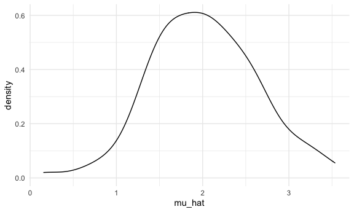
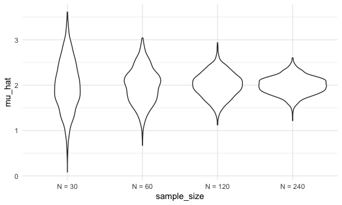
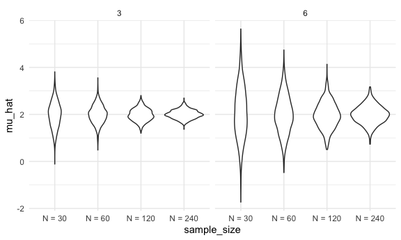

Simulation
================
Emma Sexton

## Notes from last class / in general

Edit and highlight multiple lines of text at one time: Shift + Option
and select the number of lines

Might have to re-install git when you update your computer

## Simulations!!!

Here’s our function from before:

``` r
sim_mean_sd = function(n_obs, mu = 2, sigma = 3) {
  
  sim_data = tibble(
    x = rnorm(n_obs, mean = mu, sd = sigma),
  )
  
  sim_data %>% 
    summarize(
      mu_hat = mean(x),
      sigma_hat = sd(x)
    )
}
```

How did we use this before?

``` r
sim_mean_sd(n_obs = 30)
```

    ## # A tibble: 1 × 2
    ##   mu_hat sigma_hat
    ##    <dbl>     <dbl>
    ## 1  0.691      2.85

How can we use this now…

Let’s start with a `for` loop!

``` r
output = vector("list", length = 100)

for (i in 1:100) {
  
  output[[i]] = sim_mean_sd(n_obs = 30)
  
}

bind_rows(output)
```

    ## # A tibble: 100 × 2
    ##    mu_hat sigma_hat
    ##     <dbl>     <dbl>
    ##  1  3.34       3.64
    ##  2  2.63       3.08
    ##  3  1.71       2.67
    ##  4  1.78       2.70
    ##  5  1.68       2.00
    ##  6  2.44       3.49
    ##  7  1.25       3.31
    ##  8  0.183      2.95
    ##  9  2.51       3.04
    ## 10  0.765      3.42
    ## # … with 90 more rows

Let’s use list columns instead…

``` r
sim_results_df = 
  expand_grid(
    sample_size = 30,
    iteration = 1:100
  ) %>% 
  mutate(
    estimate_df = map(sample_size, sim_mean_sd)
  ) %>% 
  unnest(estimate_df)
```

``` r
sim_results_df %>% 
  ggplot(aes(x = mu_hat)) +
  geom_density()
```



!!!!!!!!!!!!!!!!!!!

## What about changing the sample size?

I need an input list with lots of sample sizes

``` r
sim_results_df = 
  expand_grid(
    sample_size = c(30, 60, 120, 240),
    iteration = 1:1000
  ) %>% 
  mutate(
    estimate_df = map(sample_size, sim_mean_sd)
  ) %>% 
  unnest(estimate_df)
```

``` r
sim_results_df %>% 
  mutate(
    sample_size = str_c("N = ", sample_size),
    sample_size = fct_inorder(sample_size)
  ) %>% 
  ggplot(aes(x = sample_size, y = mu_hat)) +
  geom_violin()
```



``` r
sim_results_df %>% 
  mutate(
    sample_size = str_c("N = ", sample_size),
    sample_size = fct_inorder(sample_size)
  ) %>% 
  group_by(sample_size) %>% 
  summarize(
    empt_st_err = sd(mu_hat)
  )
```

    ## # A tibble: 4 × 2
    ##   sample_size empt_st_err
    ##   <fct>             <dbl>
    ## 1 N = 30            0.551
    ## 2 N = 60            0.390
    ## 3 N = 120           0.275
    ## 4 N = 240           0.197

## Let’s see two inputs …

How to map over two inputs at one time

``` r
sim_results_df = 
  expand_grid(
    sample_size = c(30, 60, 120, 240),
    true_sigma = c(6, 3),
    iteration = 1:1000
  ) %>% 
  mutate(
    estimate_df = 
      map2(.x = sample_size, .y = true_sigma, ~ sim_mean_sd(n_obs = .x, sigma = .y))
  ) %>% 
  unnest(estimate_df)
```

^^ Naming inputs very explicitly in `estimate_df`; also HAVE to use .x
and .y AND the \~ (tilda)

``` r
sim_results_df %>% 
  mutate(
    sample_size = str_c("N = ", sample_size),
    sample_size = fct_inorder(sample_size)
  ) %>% 
  ggplot(aes(x = sample_size, y = mu_hat)) +
  geom_violin() +
  facet_grid(. ~ true_sigma)
```



Be cautious about CACHE-ing results – it’ll save whatever is written in
that code chunk, but it won’t re-run unless you change something in that
code chunk
